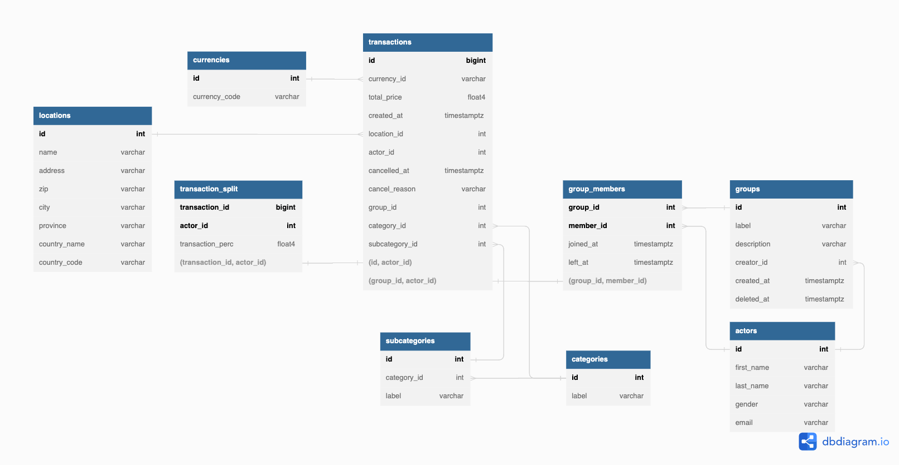

# personal-finance

## Objective

This project objective is to train data and software engineering concepts while designing and implementing a real world application.

## Context

There are many apps created to help users track their personal finances. We are going to replicate the idea of one of these applications, where the user can:
1. Add new expenses
2. Divide expenses into categories
3. Classify the person responsible for the expense
4. Track and view metrics related to these expenses

## Proposed System

1. Through an API, clients will insert data at a database. They must be able to do it synchronous or asynchronous, depending on the amount of data.
2. Data should sit at the database in 2 distinct formats: **transactional** and **analytical**
3. Ingested data needs to be transformed in order to make it proper for analytics consumption.
4. Data quality checks needs to be applied in every step deemed necessary
5. A minimum data visualization tool need to be connected to the transformed data
6. An orchestration tool needs to be used

## Database & Analytics

### Schema Configuration

Our database diagram consists of seven tables. The `transactions` table granularity is per transaction. Each has an actor, group, budget/ expense (sub)category, and currency as dimensions. Check out for more details for those on their respective tables! Also, actors from a group may split one transaction amongst two or more group members (transaction_split).